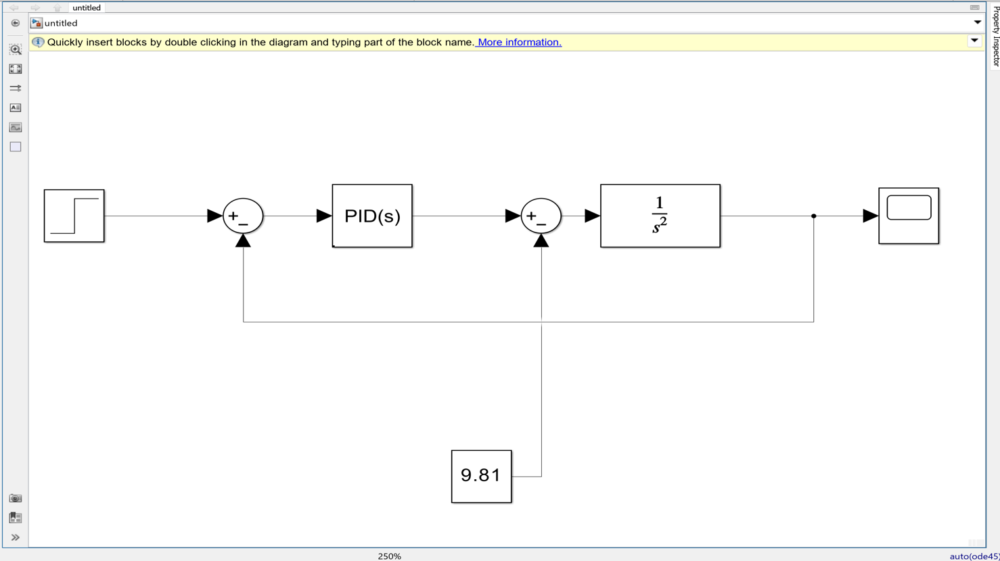
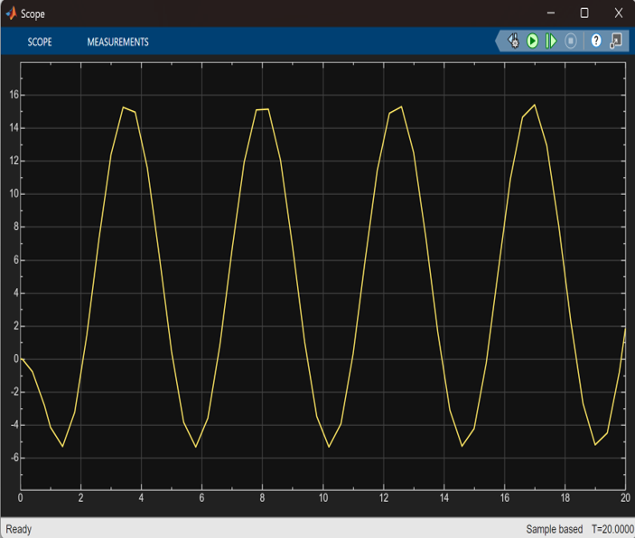
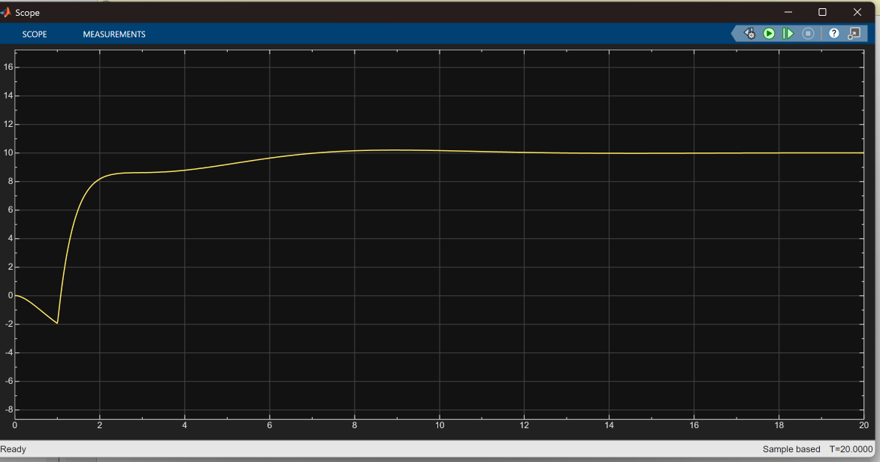

# Drone Altitude Control System: PID Stability Analysis 🚁
**Tool:** MATLAB / Simulink | **Domain:** Flight Dynamics & Control Theory

## 📌 Project Overview
This project simulates the **Altitude Hold** function of a Quadcopter. Unlike a car, a drone is an **unstable system** (modeled as a double integrator $1/s^2$) that fights against constant gravity. 

**Objective:** Command the drone to take off and hover precisely at **10 meters**.

## ⚙️ The Engineering Challenge
The physics of thrust-to-altitude is naturally unstable. Without active control, the drone will either crash or fly away. We tested three control strategies to solve this:

| Controller | Result | Observation |
| :--- | :--- | :--- |
| **P-Only** | ❌ **FAILED** | System oscillated wildly (unstable). |
| **PD** | ⚠️ **Stable but Inaccurate** | Stopped oscillating, but stuck at 7m (Steady-State Error). |
| **PID** | ✅ **SUCCESS** | Perfect hover at 10m with zero error. |

## 📸 System Architecture
*The Simulink model includes the Drone Physics ($1/s^2$), Gravity Disturbance ($9.81N$), and the Feedback Loop.*

## 📉 Comparative Analysis

### 1. The Failure (Proportional Control)
*The P-Controller cannot stop the inertia, causing the drone to bounce up and down forever.*

### 2. The Solution (PID Control)
*By adding the **Derivative (D)** term for damping and the **Integral (I)** term to cancel gravity, we achieved a smooth ascent to exactly 10 meters.*

## 🚀 Key Takeaways
- **Integral Action (I)** is essential for "Gravity Compensation" to eliminate the gap between 7m and 10m.
- **Derivative Action (D)** acts as an electronic "brake" to stop oscillations.
